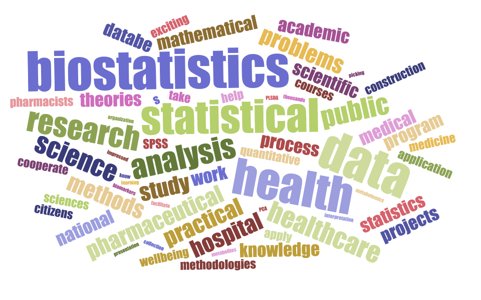

##Data Wrangling

- Individual

• Data management and descriptive statistics.

• Exploratory data analysis by comparisons and visualization.

• Write an R markdown report on the data analysis process and results.

##Data Visualization

- Group Project

• Use Github to collaboratively conduct exploratory data analysis(visualizations, summaries).

• Create a webpage and a screencast that present the project products.
